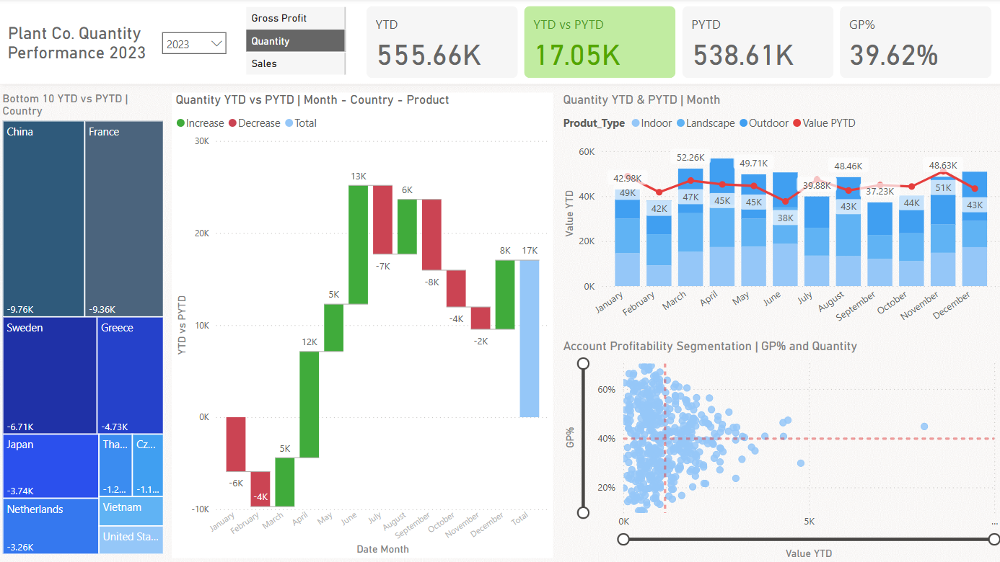

# Quality Performance Report  
**Power BI Dashboard

  

## Overview  
This dashboard tracks **Quantity and Gross Profit (GP%) performance** for Plant Co. in 2023, comparing Year-to-Date (YTD) metrics against Prior Year-to-Date (PYTD). It helps identify trends, top/bottom performers, and profitability segments across countries, products, and months.  

---

## Key Features  
### 1. Core Metrics  
- **Gross Profit (YTD):** $555.66K  
- **YTD vs PYTD Difference:** +$17.05K  
- **GP%:** 39.62%  

### 2. Interactive Visualizations  
- **Bottom 10 Performers:** Countries with negative YTD vs PYTD trends (e.g., Greece: -$3.26K)  
- **Quantity Trends:** Monthly sales by country and product type (Indoor, Landscape, Outdoor)  
- **Profitability Segmentation:** GP% vs. Quantity scatter plots  

### 3. Filters & Interactivity  
- Toggle between **Product Types** (Indoor, Landscape, Outdoor)  
- Drill down into **monthly/country-level data**  

---

## Data Sources  
- Internal sales database (e.g., SQL, Excel, or ERP system)  
- Metrics calculated from **YTD (2023)** and **PYTD (2022)** datasets  

---

## How to Use  
1. **Open in Power BI Desktop:** Load the `.pbix` file  
2. **Refresh Data:** Click `Refresh` in the `Home` tab if data sources are connected  
3. **Explore:**  
   - Use **slicers** (e.g., Product Type) to filter views  
   - Hover over visuals to see tooltips (e.g., GP% details)  
   - Click on bars/maps to drill into specific regions/months  

---

## Setup Requirements  
- **Power BI Desktop** (2023 or later)  
- Access to the underlying data sources (if refreshing)  

### Notes  
- **Increase/Decrease Arrows:** Highlight positive/negative trends  
- **Bottom 10 Table:** Prioritize corrective actions for underperforming countries  
